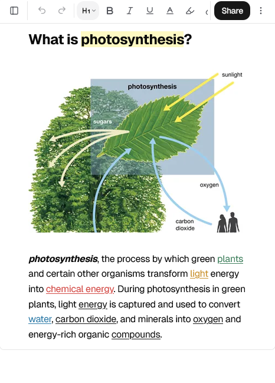
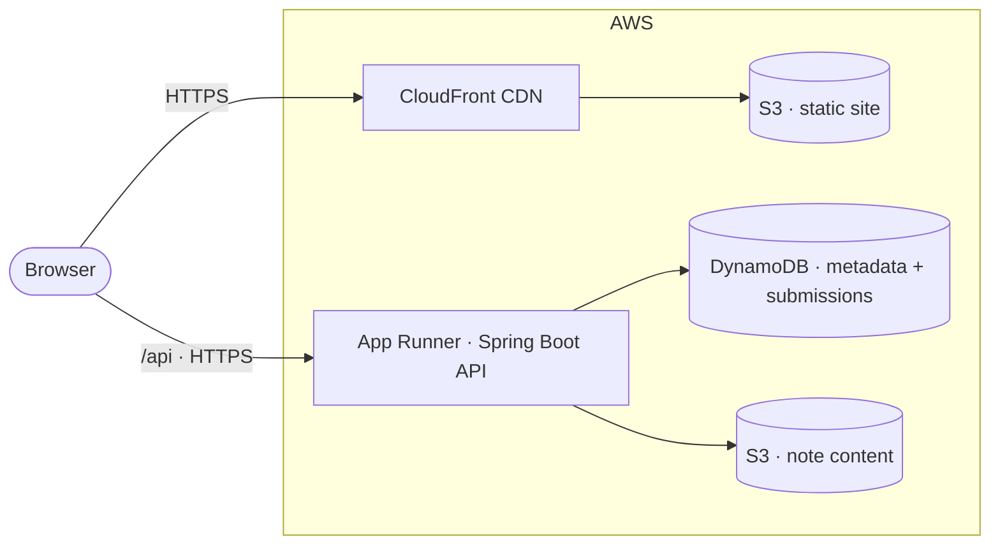
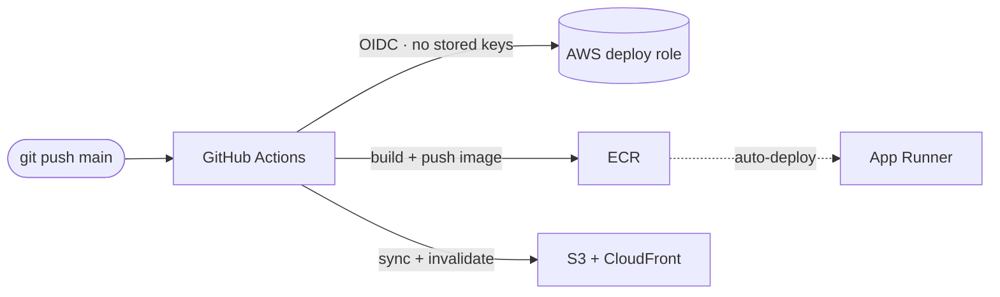

# Pasquin

**Anonymous notes, shared instantly.** Write a note, get a shareable link — no account required. Optionally protect it with a password or set it to auto-expire.

🔗 **Live demo:** https://d1ilylb2b5and1.cloudfront.net

> *A [pasquinade](https://en.wikipedia.org/wiki/Pasquinade) is an anonymous note posted in a public place — named after "Pasquino," a statue in Renaissance Rome where people stuck up anonymous verses. That's exactly what this app is: anonymous notes, posted to a public link.*

<!--
  SCREENSHOTS: add 2–3 here once captured, e.g.
  
  
-->

---

## Features

- **Rich text editor** — headings, lists, task lists, code blocks, highlighting, text color, links (built on TipTap).
- **Anonymous ownership** — no sign-up. Each note returns a one-time **edit key** that proves ownership; the server only ever stores its hash.
- **Shareable links** — view-only by default, or an editable link that carries the key in the URL fragment (never sent to the server).
- **Password protection** — reader-facing passwords, hashed with BCrypt. Protected notes hide their title *and* content until unlocked.
- **Auto-expiry** — 1 hour to 1 month, implemented server-side with DynamoDB TTL (the note deletes itself).
- **My Notes** — a per-browser sidebar (search, rename, delete, copy link) backed by `localStorage`.
- **Sharing extras** — one-click copy, email, and a generated **QR code** for handing a note to a phone.
- **Abuse reporting & contact** — public forms with validation, rate limiting, and a spam honeypot.
- **Dark / light theme**, responsive down to mobile.

## Architecture



Static frontend served globally from **CloudFront + S3**; a containerized Spring Boot API on **App Runner** persists note metadata to **DynamoDB** and note bodies to **S3**. Everything is defined in Terraform.

### CI/CD



Push to `main` and the changed app deploys itself. GitHub authenticates to AWS via **OIDC** — there are no long-lived AWS credentials stored anywhere.

## Tech stack

| Layer | Tech |
| --- | --- |
| **Frontend** | Astro 5, React 19, TipTap 3, Tailwind CSS 4, shadcn/ui, TypeScript |
| **Backend** | Spring Boot 4, Java 25, AWS SDK v2, BCrypt, Bucket4j (rate limiting) |
| **Data** | DynamoDB (on-demand, TTL), S3 |
| **Infra** | Terraform · App Runner, CloudFront, ECR, DynamoDB, S3, IAM |
| **CI/CD** | GitHub Actions with OIDC federation |
| **Quality** | Spotless (Google Java Format), `astro check`, JUnit |

## How anonymous ownership works

There are no user accounts, yet notes are still editable and deletable only by their creator:

1. On save, the server generates a random **128-bit edit key**, returns it **once**, and stores only its **SHA-256 hash**.
2. Updates and deletes require the key in an `X-Edit-Key` header; a wrong key gets a `403`.
3. The browser keeps a `slug → key` map in `localStorage` — that map *is* the "My Notes" list.
4. Editable share links put the key in the URL **fragment** (`/n/{slug}#key`), which browsers never transmit to a server, so the key stays private even in transit.

This keeps the product frictionless (no login) while still enforcing ownership. Google sign-in — to sync that local key map across devices — is the planned next step.

## Local development

Backend (runs on `:8080` with an in-memory store — no AWS needed):

```bash
cd backend
./mvnw spring-boot:run
```

Frontend (runs on `:1234`, proxies to the local backend):

```bash
cd frontend
npm install
npm run dev
```

Run the backend test suite:

```bash
cd backend
./mvnw verify   # unit tests + Spotless format check
```

## Deployment

Infrastructure is fully codified in [`infra/`](infra/) (Terraform). See [`infra/README.md`](infra/README.md) for the step-by-step deploy runbook and cost notes. In short: Terraform provisions everything, and GitHub Actions handles ongoing deploys.

## Project layout

```
pasquin/
├─ frontend/   # Astro + React app
├─ backend/    # Spring Boot API
├─ infra/      # Terraform (AWS)
└─ .github/    # CI/CD workflows
```

## Credits & license

The frontend is built on the [astro-erudite](https://github.com/jktrn/astro-erudite) template (MIT © Trevor Lee); that license is retained in [`frontend/LICENSE`](frontend/LICENSE). Application code, backend, and infrastructure are original work.
